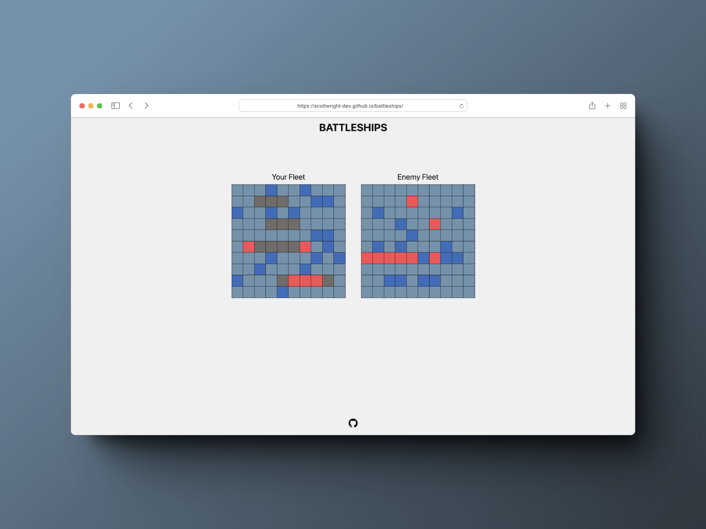
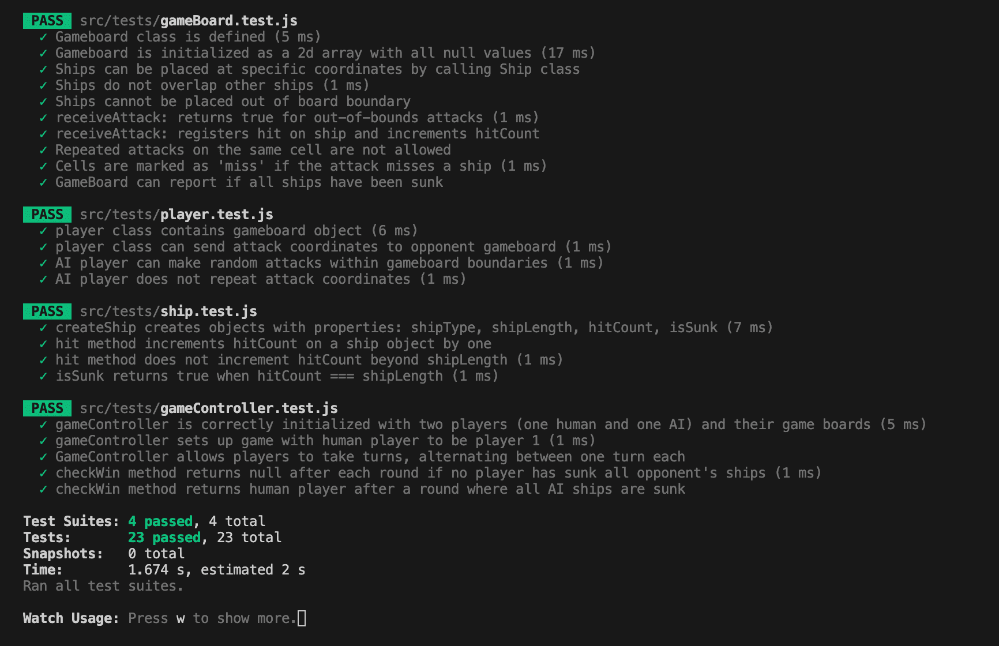

## Table of Contents

1. [Description](#description)
2. [Demo](#demo)
3. [Design](#design)
4. [Features](#features)
5. [Unit Test Results](#Unit-Test-Results)
6. [Technologies Used](#technologies-used)
7. [Project Challenges](#project-challenges)
8. [Thoughts & Observations](#thoughts-and-observations)
9. [Future Enhancements](#future-enhancements)
10. [Installation](#installation)

## Description

A project from [The Odin Project](https://www.theodinproject.com/lessons/node-path-javascript-battleship) an implementation of the classic Battleship game which served as a practical exercise to grasp Test Driven Development principles utilizing [Jest](https://jestjs.io/).

The focus of the assignment revolved around employing unit testing to construct and verify the game-play logic, ensuring a solid foundation and functionality.

## Demo

Click here: [https://scottwright-dev.github.io/battleships/](https://scottwright-dev.github.io/battleships/)

## Design

<div align='center'>

</div>

## Features

- **TDD Approach**: A test-first, fail/pass methodology was followed in developement utilizing Jest to ensure code reliability.
- **Object-Oriented Game Elements**: Structured game elements such as ships, gameboards, and players using OOP principles to encapsulate state and behavior.
- **Game-play against AI opponent**: The user plays against a basic automated computer player capable of making random moves within the game's rules.
- **Turn-Based Mechanics**: Follows a turn-based system that mimics the classic Battleship game-play.
- **Interactive UI**: The UI allows players to manually position their ships and engage with the enemy board through mouse interactions for attack placement.
- **Optimized for Desktop**: Currently game-play is supported on desktop platforms.

## Unit Test Results

<div align='center'>

</div>

## Technologies Used

- Javascript
- HTML
- CSS
- Jest
- Webpack

## Project Challenges

Initially, testing was a very challenging concept for me. Comprehending and retaining in my working memory the overall functionality and requirements of each class/method that I was trying to test often led to frustration and feelings of being overwhelmed.

To simplify this, I focused on unit testing. I found that when I attempted to write more elaborate mock tests, they quickly became unmanageable as it was difficult to comprehend the games functionality, particularly in the early stages of development.

The implementation of a drag-and-drop system for placing ships on the board was particularly trying. I explored the Drag & Drop API but couldn't get this approach to work effectively.

This exploration led me to discover the [NeoDrag](https://www.neodrag.dev/)
library. However, it became clear that I was probably attempting to implement a feature too complex for the project's scope, which was primarily to learn TDD fundamentals.

This realization prompted me to re-evaluate my approach and instead implement a far simpler solution using hover states and event listeners.

## Thoughts and Observations

The initial development of the game led me to follow an object-oriented approach to organise the game logic. However as I began considering the UI, I felt a more functional style was more intuitive.

I was uncertain if mixing these two paradigms was the right approach. OOP seemed a natural fit for crafting the game's core logic, with its ability to encapsulate the state and behaviors of game elements like ships and boards. However, as I delved deeper into the UI development, I began to see the potential advantages of a more Functional Programming approach. This led me to conduct further research into the benefits and possible drawbacks of blending these methodologies, which I ultimately went for.

It’s been a learning curve, and though initially challenging, it’s been rewarding to see how these two approaches can work together to compliment one another, contributing to a more adaptable and well-organized codebase.

## Future Enhancements

**Mobile Friendliness**: Currently optimized for desktop, the game could be adapted for mobile platforms. This would involve addressing challenges in touch-based ship placement and overall UI/UX design for smaller screens.

**Improved AI Intelligence**: Enhancing the AI's intelligence to offer a more challenging and engaging gameplay experience.

**General Style Improvements**: Refining the game's visual and interactive elements to provide a more polished and immersive experience.

**End-to-End Testing**: Explore tools like Cypress for comprehensive testing to ensure robustness and reliability across all aspects of the game.

## Installation

To set up the Battleship game locally, please follow these steps:

1. Clone the GitHub repository to your machine:

   ```bash
   git clone https://github.com/scottwright-dev/battleship
   ```

2. Navigate to the project's directory:

   ```bash
   cd battleship
   ```

3. Install the project's dependencies using npm:

   ```bash
   npm install
   ```

4. Build the project to bundle JavaScript, HTML and CSS:

   ```bash
   npm run build
   ```

5. The build files will be found in the `dist` directory.

##
